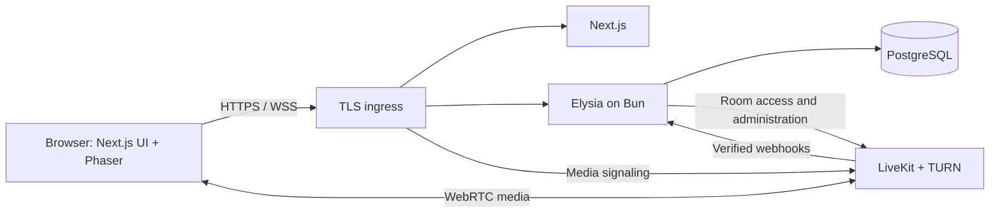

# Pixel Office — system design draft

Date: 2026-09-07. Status: initial application implemented and verified locally; VM deployment, capacity validation, and the real SSO provider integration remain pending. See README.md for the runnable implementation and its current limits. The sections below retain the design baseline; provider group admission, back-channel logout, off-VM backup automation, and production TURN validation are follow-up deployment work.

## Scope and working assumptions

Build a browser-based pixel-art office using Next.js and Elysia. Members walk around, see colleagues' availability, talk, use cameras, share screens, wave, and summon colleagues.

Confirmed requirements: support OIDC SSO and username/password authentication, with an administrator-controlled on/off switch for password login. Use password login for initial development and testing; integrate and test the user's SSO provider later. Conversation mode is nearby voice plus meeting rooms.

The implementation has one private team with one active shared map, selected by the owner from six layouts: nature, camping, and space themes, each for 4–8 or 10–12 people. These are seating recommendations, not admission limits. Workspace name and map selection persist in PostgreSQL. Changing maps ends active conversations and resets everyone to a safe entrance. Desktop browsers come first; the initial capacity test target remains 25 simultaneous members, not a measured capacity promise. Assume all application and media processes run on the user's Linux VM until hosting preferences are confirmed.

## User experience

- **Arrival:** sign in with username/password when enabled, or select “Sign in with SSO” when the provider is configured and enabled. Select a pixel avatar, preview microphone/camera, and enter the office if authorized. Camera starts off. The user explicitly enables their microphone and nearby conversation mode.
- **Office:** a top-down tile map with desks, plants, a lounge, meeting rooms, and a quiet area. Move with WASD/arrows; do not intercept keys while typing in a form. Collision prevents walking through furniture and walls.
- **People:** searchable list showing name, status, location, and call activity. Selecting someone offers Wave, Summon, and Call. The list also provides keyboard-accessible navigation to rooms.
- **Voice/video:** microphone and camera are independently controlled. Show speaking indicators, device selection, connection state, and the actual audience of the current conversation.
- **Screen sharing:** user chooses a tab, window, or display using the browser picker. A main stage shows the shared screen, with camera thumbnails beside it. Start with one presenter per conversation; an atomic server-side presenter claim prevents accidental competing shares.
- **Wave:** a short avatar animation and a lightweight notification for the recipient. No movement or call starts. Initial per-target cooldown: five seconds.
- **Summon:** send “Alex invites you to Meeting Room A” with Accept and Decline. On acceptance, recheck access and available destination space, then move the recipient to a valid arrival tile. Expire requests after 30 seconds. Accepting a summon does not enable devices. If the recipient is already in a call, show the conversation change before accepting.
- **Direct call:** ring a person; acceptance joins a dedicated conversation without requiring avatar teleportation. Busy and DND recipients are not automatically interrupted.
- **Status:** Available, Busy, DND, Away, plus optional short custom text. Show In call / Presenting as separate activity badges. Offline comes from connection state. Auto-away after five minutes without interaction unless actively in a call; manual DND remains until cleared. Treat these timers as tunable starting values.

DND silences wave and summon alerts and excludes the member from automatic nearby conversations. Entering DND during an existing call does not silently end that call. Provide an explicit Leave conversation action.

Screen capture requires a user gesture and fresh browser permission; shared audio availability varies by browser, operating system, and selected capture source. Test supported browsers rather than promising every screen/audio combination. [Browser capture requirements](https://developer.mozilla.org/en-US/docs/Web/API/MediaDevices/getDisplayMedia), [LiveKit screen sharing](https://docs.livekit.io/transport/media/screenshare/).

## Visual direction

Use original or appropriately licensed pixel art: 32-pixel tiles, four-direction animated avatars, warm wood, cream walls, green plants, and a restrained accent palette. Preserve crisp edges with nearest-neighbor scaling. Give rooms clear floor and doorway cues.

Keep menus and call controls readable with ordinary UI typography; reserve pixel lettering for short decorative labels. Show status with an icon and text as well as color. Support reduced animation and a usable people/room list outside the canvas.

```text
┌ Office name · Connected ───────────────────── People · Settings ┐
│                                                  │ People      │
│                PIXEL OFFICE MAP                  │ Search      │
│                                                  │ Ava · Ready │
│   Desks        Lounge        Meeting rooms        │ Ben · Busy  │
│                                                  │             │
│   Pixel avatars with names and speaking rings    │ Wave / Call │
├──────────────────────────────────────────────────┴─────────────┤
│ Mic   Camera   Share screen   Status   Current audience   Leave │
└────────────────────────────────────────────────────────────────┘
```

Opening a shared screen enlarges the stage and reduces the map to a small panel. The user can return to the map without stopping the share.

## Architecture

| Technology | Responsibility |
|---|---|
| Next.js + React + TypeScript | Sign-in, office shell, people list, controls, video layout, admin settings |
| Phaser, loaded only in the browser | Tile map, avatars, animation, collision rendering, camera movement |
| Elysia on Bun | Authentication integration, authorization, HTTP endpoints, office WebSocket, movement validation, invitations, media access decisions |
| PostgreSQL | Accounts, sessions, memberships, office configuration, room policy, avatar preferences |
| LiveKit SFU with embedded TURN | WebRTC signaling and forwarding of audio, camera, and screen tracks; fallback media connectivity |
| Docker Compose + TLS ingress | Deploy and operate the processes on the VM |

Phaser has an official Next.js integration template. Elysia provides native WebSocket routes with schema validation. Use those capabilities directly. Next.js supports self-hosting behind a reverse proxy. [Phaser templates](https://docs.phaser.io/phaser/getting-started/project-templates), [Elysia WebSocket](https://elysiajs.com/patterns/websocket), [Next.js self-hosting](https://nextjs.org/docs/app/guides/self-hosting).



Video bytes never travel through the Elysia office WebSocket. Next.js owns rendering; Elysia owns application rules. Keep one Elysia process initially so office state has one authoritative owner. No application Redis, message broker, or Kubernetes in the first version. LiveKit may use its own Redis if required by the chosen production deployment configuration.

## Authentication — OIDC SSO and optional username/password

Elysia owns username/password login, OIDC login/callback, application sessions, and logout under `/api/auth/*`. Next.js displays enabled login methods and consumes the same-origin application session. Both methods resolve to the same application user and membership checks. Start with one administrator-configured OIDC issuer; the actual provider remains to be supplied later.

**Login switches:** Settings → Authentication exposes “Enable username/password login” and “Enable OIDC SSO.” Persist these deployment-wide settings in PostgreSQL, editable only by an owner after recent authentication. Initial test setup enables password login and leaves SSO disabled until configured. Enforce enabled methods on the server, including pending OIDC callbacks; hiding a form is insufficient. Serialize setting changes so concurrent updates cannot disable both methods. Turning password login off invalidates password-authenticated sessions and disconnects their office/media access. Turning SSO off does the same for SSO-authenticated sessions. Existing credentials and profiles remain available for later re-enablement.

Before disabling password login, require a successful SSO sign-in linked to an owner account and a currently enabled SSO configuration. A configuration change clears that verification. Reject disabling the last working owner login method. Changes take effect without redeploying, are recorded in an audit log without secrets, and are rechecked when a login completes to avoid races. Provider failure never automatically re-enables passwords.

**Local accounts:** use administrator-provisioned usernames and passwords for the initial private-team version, with no public registration. Define normalized unique usernames; store salted Argon2id password hashes through an established library, never plaintext passwords. Apply login throttling by account and source, generic failure responses, and session revocation on password reset. Bootstrap the first local owner through a deployment command with a hidden password prompt; no default or hardcoded test credentials. Admin-issued temporary passwords expire and must be changed before office access. Local recovery is an authorized admin reset, or an explicit audited VM administration command for owner recovery. [OWASP password storage](https://cheatsheetseries.owasp.org/cheatsheets/Password_Storage_Cheat_Sheet.html), [OWASP authentication](https://cheatsheetseries.owasp.org/cheatsheets/Authentication_Cheat_Sheet.html).

Use an established OIDC client library compatible with Bun. Implement Authorization Code Flow with PKCE S256, transaction-bound `state` and `nonce`, and a fixed registered HTTPS callback URL. Discover endpoints and signing keys from the configured issuer; validate ID-token signature, issuer, audience, expiry, and nonce through the library. Provider URLs are deployment configuration, never user input. These choices follow [OpenID Connect Core](https://openid.net/specs/openid-connect-core-1_0-18.html) and [OAuth security best practice](https://www.rfc-editor.org/info/rfc9700/).

After successful OIDC validation, identify the identity by the unique pair `(issuer, subject)`. Treat name and email as profile attributes; do not link accounts or grant office access merely because email addresses or usernames match. Create the application profile on first valid SSO login, but grant membership only through the configured admission policy. Proposed default: admin-approved membership. If the provider offers a dedicated application group, explicit group-to-member mapping can replace approval. Missing required claims deny admission; owner/admin roles require explicit assignment. An SSO-first deployment can bootstrap the owner with a configured issuer/subject pair rather than making the first visitor an administrator.

To retain a test user's avatar, membership, and role when moving to SSO, provide “Link SSO” from account settings: require recent local authentication and a fresh successful OIDC flow bound to that user and session. Enforce unique identity ownership and reject an identity already linked to another user. Creating a password for an SSO user requires explicit administrative authorization; it must not silently bypass a provider's access or MFA policy. Application-wide account disablement revokes both login methods; provider disablement alone does not disable an independently authorized local credential.

Issue an opaque, revocable application session stored in PostgreSQL, recording the authentication method and policy version, with only its secure HttpOnly SameSite cookie in the browser. Keep OIDC tokens server-side and retain them only when needed for the selected provider's session/logout integration. An ID token is not the credential for office WebSockets or LiveKit; both use application authorization. SSO MFA and SSO password recovery belong to the identity provider.

Application logout revokes the application session, closes office connections, and removes media access using the conversation revocation policy. For SSO sessions, use provider logout capabilities where supported. Disabling a user at the provider does not inherently revoke an existing application session: enforce a bounded session lifetime and fresh authentication with an enabled method at expiry, and integrate validated back-channel logout if available. Provider capability and required deprovisioning delay must be confirmed before claiming immediate SSO revocation. Active WebSockets must enforce session expiry and authentication-policy changes too.

Deployment configuration: issuer URL, client ID, server-only client credential when required, registered redirect URL such as `https://office.example.com/api/auth/callback`, post-logout URL, and admission policy. Register the app with the provider once the production domain is known. Request `openid profile email` initially; group claims are provider-specific and needed only if used for admission.

Acceptance checks: successful and failed password login; password hashing, throttling, and reset revocation; disabled-method rejection through direct endpoint calls; session/socket/media removal on method disablement; owner lockout prevention under concurrent setting changes; password-to-SSO linking preserves the user without email-based merging. Reject invalid OIDC issuer/audience/signature, expired tokens, mismatched state/nonce, reused callbacks, and callbacks completing after SSO is disabled. Deny unapproved users office/media access and ensure logout/session expiry terminates connections. Password and office tests now run locally; validate real SSO once provider details are available. These are the intended acceptance criteria, not a claim that every provider-specific scenario has been exercised.

## Conversations and privacy

An **office** is the shared map and membership list. A **zone** is an authored region on that map. A **conversation** is a group currently exchanging media. These are different objects: being visible on the same office map does not grant access to every conversation.

Support three conversation types:

1. **Nearby conversation — confirmed:** an open floor has a shared LiveKit room. Subscribe to nearby members' tracks and adjust volume by distance. Start with a three-tile join radius and five-tile leave radius with a one-second delay, to avoid repeated changes near the edge. Check map zone and intervening walls, not just distance. The exact distances require a playtest.
2. **Meeting zone:** entering an authorized zone joins its dedicated LiveKit room and leaves open-floor media. Everyone in the meeting hears one another regardless of their exact tile. Locked zones require explicit admission. Show access state before crossing the doorway.
3. **Direct call:** accepted participants join a dedicated LiveKit room. Nearby conversation stays suspended until the call ends.

LiveKit supports selective track subscription and adaptive streams. Disable automatic subscription where the application chooses the audience. [LiveKit subscriptions](https://docs.livekit.io/transport/media/subscribe/).

**Public-floor proximity is a convenience, not a confidentiality guarantee.** A modified client with access to the floor room may request distant tracks. Explain that floor conversation is public to that floor; use isolated meeting/direct-call rooms for private speech. If the requirement is that even malicious clients cannot hear beyond a spatial radius, replace the floor room with server-authorized conversation groups before shipping proximity audio. That is a product decision still to confirm.

Only one conversation is active per user. Device capture does not imply permission to publish into another conversation. During a transition, stop old publication, disconnect from the old room, validate the new membership, then join and publish according to the user's chosen device settings. Stop screen sharing on a conversation change so it cannot silently reach a new audience. Display a transition state; do not briefly publish into both rooms.

Elysia issues room-scoped tokens with opaque participant IDs, restricted publication sources, and a short initial TTL. Never expose the LiveKit secret to the browser. Token issuance derives room membership on the server rather than trusting a submitted room name.

Self-hosted LiveKit does not immediately revoke existing tokens when a participant is removed, and token expiry does not terminate an existing connection. For private conversation membership removals, use a new unpredictable room generation: stop media in the old generation, disconnect all participants, and rejoin only authorized remaining members in the new generation. This causes a brief reconnect but prevents an old token reaching ongoing private media. Apply the same rule to workspace membership revocation. Validate this behavior explicitly before release; short token TTL alone is insufficient. [LiveKit token lifecycle](https://docs.livekit.io/frontends/reference/tokens-grants/).

## Office state and interfaces

Use four application modules with narrow interfaces: identity/membership, office state, social actions, and conversations. These can live in the same Elysia application; they do not need independent deployment or generic adapter frameworks.

**Persistent data:** users, optional local credentials with unique normalized usernames and password hashes, OIDC identities with a unique `(issuer, subject)` constraint, revocable application sessions with authentication method/policy version, authentication settings and audit records, offices, memberships with owner/admin/member role, authored map version, meeting-zone access rules, avatar selection, manual availability, and custom status. Use established authentication and session libraries compatible with the stack.

**Ephemeral data in Elysia memory:** connections, current positions, active zone, heartbeat time, auto-away state, wave cooldowns, pending summons/calls, conversation membership, presenter claims, and room generation IDs. LiveKit owns actual media-track state; reconcile using its events and verified webhooks. A process restart loses movement/invitations and requires a fresh office snapshot. Reconcile or retire old media rooms before admitting new sessions.

The map is a versioned tile-map asset containing visual layers, collision, spawn points, zone geometry, and room references. Serve the same version to the browser and server. Start with one authored map; an in-browser map editor is outside this version.

HTTP handles sign-in/session, office bootstrap, preferences, admin membership, and authorized media-token requests. The office WebSocket handles movement, availability, waves, invitation responses, and membership changes. Validate all messages against a shared TypeScript schema with runtime checks.

| Client intent | Server response/event |
|---|---|
| `move {seq, direction}` | Position delta with acknowledged sequence |
| `set_status {availability, text}` | Updated presence |
| `wave {targetId, requestId}` | Accepted/rejected acknowledgment; targeted wave |
| `summon {targetId, destinationId, requestId}` | Invitation with server expiry |
| `respond_summon {invitationId, accept}` | Atomic result; authorized movement if accepted |
| `request_call` / `respond_call` | Ringing, accepted, declined, expired, or busy |
| `enter_zone` / `leave_conversation` | Authorized conversation assignment or rejection |
| `claim_presenter` / `release_presenter` | Current presenter or conflict |

Infer actor identity and office membership from the authenticated connection. Validate position-dependent intents against server positions. Invitation acceptance is single-use and idempotent; recheck recipient, expiry, inviter presence, destination permission, and current conversation.

Target 10–15 movement updates per second with smooth client interpolation and local prediction. The server clamps speed, rejects invalid coordinates, checks collisions, and corrects the client. Use a sequence number and a server epoch so reconnects cannot apply old deltas to a new snapshot. Bound queues and discard superseded movement updates for slow clients.

Use heartbeats and a short disconnect grace period; after expiry, mark offline, release presenter/invitation state, and remove media access. Start with one active office session per user, with an explicit takeover flow for another tab/device.

Authenticate WebSocket upgrades, check Origin, limit payload sizes and message rates, and authorize every office action. Use secure HttpOnly sessions with CSRF protection for state-changing HTTP operations. Keep tokens out of URLs and logs.

## VM deployment

Use Docker Compose with pinned versions, restart policies, health checks, and persistent database storage. Run Next.js and Elysia as separate processes. Put PostgreSQL and internal application/media administration ports on private interfaces.

Proposed DNS names: `office.example.com` for the app, `rtc.example.com` for media signaling, and `turn.example.com` for TURN. All can point to one public IP, with trusted TLS certificates. Route `/api/*` and `/ws` from the app origin to Elysia to simplify session handling.

LiveKit supplies a VM deployment flow using Docker Compose and Caddy. Use its generated ingress configuration as the starting point. Sharing TCP 443 between HTTPS and TURN/TLS on one IP requires TLS/SNI-aware layer-4 routing; an ordinary HTTP reverse proxy alone cannot route TURN. Preserve that setup while adding the web application. [LiveKit VM deployment](https://docs.livekit.io/transport/self-hosting/vm/), [LiveKit deployment requirements](https://docs.livekit.io/transport/self-hosting/deployment/).

Expected public ports, subject to the generated configuration:

| Port | Purpose |
|---|---|
| TCP 80 | Certificate issuance / HTTPS redirect |
| TCP 443 | HTTPS, WSS, and TURN/TLS through the configured ingress |
| TCP 7881 | WebRTC TCP fallback |
| UDP 3478 | TURN/UDP, if enabled |
| UDP 50000–60000 | Default direct WebRTC media range |

LiveKit also supports a configured single UDP media mux port instead of the range. Select one mode and match both the VM firewall and provider firewall. TCP 7880 remains behind ingress. Restrict SSH to administrator access and do not expose PostgreSQL. [LiveKit ports](https://docs.livekit.io/transport/self-hosting/ports-firewall/).

A single VM is one failure domain: host loss interrupts both the office and calls. Maintain automated encrypted off-VM database backups, verify restoration, rotate logs, monitor CPU/memory/network and media join failures, and plan maintenance reconnects. Recording and file uploads are outside the initial scope, so no recording workers or object-storage layer is needed initially.

Do not choose a VM size from participant count alone. Measure simultaneous publishers, visible video tracks, screen-share viewers, TURN usage, and available outbound bandwidth. As an illustrative calculation, ten publishers at 1 Mbit/s each, each forwarded to nine viewers, require roughly 90 Mbit/s of server egress before audio, protocol overhead, and retransmission; that is about 40.5 GB per hour. This is arithmetic, not a LiveKit benchmark or a promised video bitrate.

## Implementation order and acceptance

1. **Deployed media slice:** establish username/password login, login-method switches, and membership using explicitly provisioned test accounts. Confirm VM/DNS/firewall and run a two-person voice/video/screen-share call through the deployed domain. Test from separate networks and force TURN relay. SSO provider availability does not block password-based development or testing.
2. **Walkable office:** add the authored map, avatars, authoritative movement, collisions, presence, reconnect, and accessible people list.
3. **Office interactions:** add wave, summon acceptance/expiry, availability/DND, direct calls, meeting zones, and nearby voice, including explicit audience display and transition behavior.
4. **SSO integration and release validation:** when provider details arrive, register the OIDC client, test sign-in/account linking/logout, and verify the owner can disable password login and continue through SSO. Keep the password setting under owner control; do not switch automatically. Exercise the expected peak number of browsers/media publishers on the actual VM, check target desktop browsers, backup restore, process restarts, and private-room access controls.

Critical checks: unauthorized membership/token requests fail; distant public users do not receive tracks through the ordinary UI; outsiders cannot join private rooms; revoked tokens cannot reach the new private-room generation; summon accept is atomic; DND suppresses interruptions; map/call transitions stop old publication; screen sharing never crosses to a new audience without a new action; WebSocket reconnect produces no ghost avatars; a forced TURN call works on the deployed host.

Start without recording, persistent text chat, calendar integration, file sharing, mobile touch controls, map editing, billing, or multiple organizations. These are optional later features, not implied by the current request.

## Questions to settle

1. Expected peak online members; largest meeting; VM CPU, RAM, OS, region, network speed and transfer allowance; whether a domain is available.
2. Nearby voice plus meeting rooms is confirmed. The proposed public-floor privacy model remains a separate decision: is public-floor audio sufficient, or must distance be enforced against modified clients?
3. One private team or multiple organizations? Fully self-hosted media or managed media acceptable?
4. OIDC SSO plus switchable username/password login is confirmed. Use password login for testing now and supply the SSO provider later. Confirm provider-based admission/group mapping, required deprovisioning delay, and logout capabilities during SSO integration.
5. Confirm summon means an invitation to teleport after acceptance, and say whether mobile support or a map editor is needed in the first release.

The first three question groups have been asked in the conversation. Unanswered choices remain proposals.
